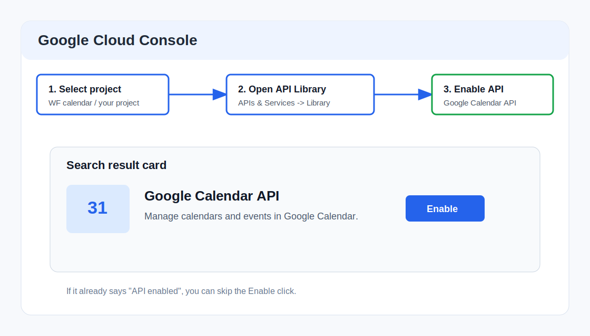
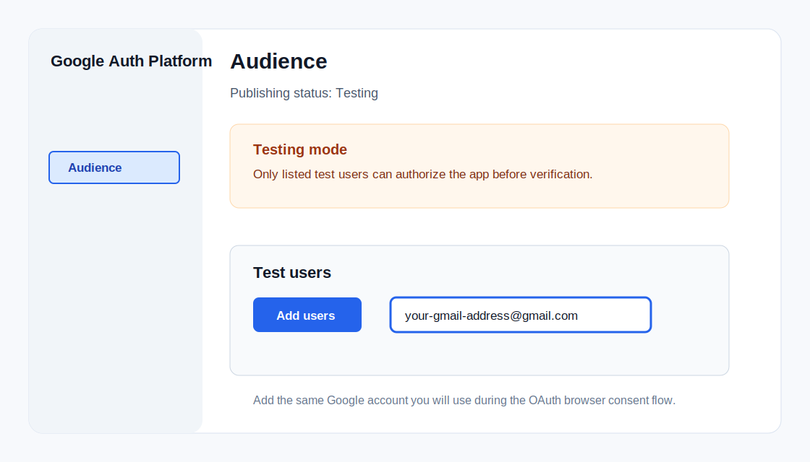
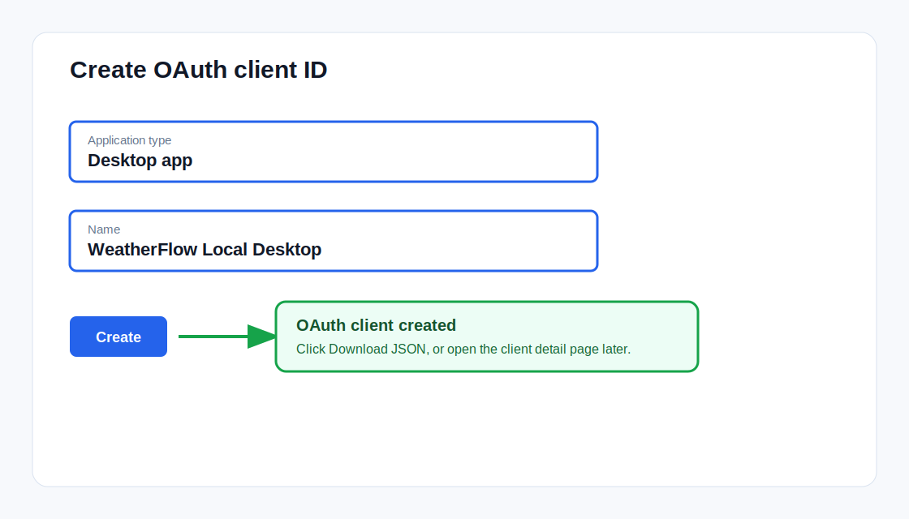
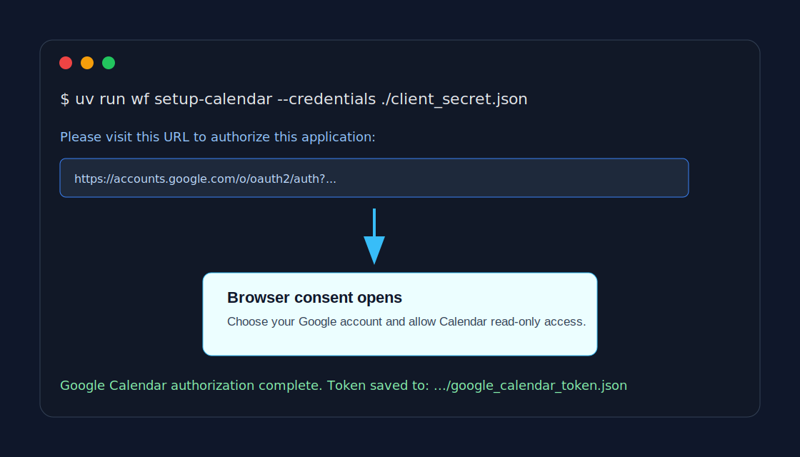
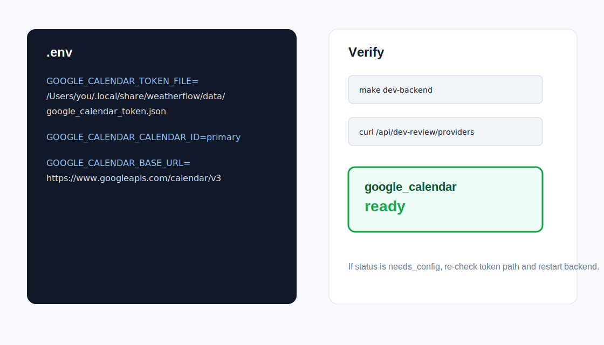

# WeatherFlow Google Calendar 配置操作手册

这份手册从零开始说明：如何在 Google Cloud Console 里创建 Calendar API 和 OAuth Desktop client，如何让 WeatherFlow 通过本地 OAuth 授权读取 Google Calendar，以及如何确认配置成功。

目标读者是不熟 Google Cloud 的新手，所以步骤会写得很细。你只需要照着做，不需要理解 OAuth 的全部原理。

## 你最终会得到什么

完成后，WeatherFlow 的 Dev Review 会多一个 Google Calendar 输入源，用来读取：

- 会议数量和会议时长
- 一周内的日程压力
- 可用于判断 focus window 的日历信息

WeatherFlow 使用的权限是：

```text
https://www.googleapis.com/auth/calendar.readonly
```

意思是“只读日历”。它不能创建、修改、删除你的日历事件。

## 准备工作

开始前确认 4 件事：

1. 你能登录 Google Cloud Console。
2. 你知道自己要给哪个 Google 账号授权，比如 `your.name@gmail.com`。
3. WeatherFlow 项目已经在本机，可以在项目根目录执行命令。
4. 本机装好了项目依赖，至少能执行：

```bash
uv run wf --help
```

如果命令不存在，先回到项目根目录执行：

```bash
make install
```

## 整体流程

```text
Google Cloud 项目
  -> 启用 Google Calendar API
  -> 配置 Google Auth Platform
  -> 添加测试用户
  -> 创建 OAuth Desktop client
  -> 下载 client JSON
  -> 本地运行 wf setup-calendar
  -> 浏览器同意 Calendar 只读权限
  -> .env 写入 token path
  -> 重启后端并验证 provider ready
```

## 第 1 步：打开或创建 Google Cloud 项目

打开 Google Cloud Console：

```text
https://console.cloud.google.com/
```

确认顶部项目选择器里选中的是你要给 WeatherFlow 用的项目。项目名可以随便起，例如：

```text
WF calendar
```

如果没有项目：

1. 点击顶部项目选择器。
2. 点击 `New Project` / `新建项目`。
3. 项目名填写 `WF calendar` 或你喜欢的名字。
4. 点击 `Create` / `创建`。
5. 等项目创建完成后，切换到这个项目。



## 第 2 步：启用 Google Calendar API

在 Google Cloud Console 顶部搜索框搜索：

```text
Google Calendar API
```

然后进入 `Google Calendar API` 页面。

你也可以从左侧导航进入：

```text
APIs & Services -> Library
```

进入 API 页面后：

1. 确认页面标题是 `Google Calendar API`。
2. 如果看到 `Enable` / `启用`，点击它。
3. 如果看到 `API enabled` / `API 已启用`，说明已经完成，可以直接进入下一步。

不要启用别的 Calendar 相关 API，只需要 `Google Calendar API`。

## 第 3 步：进入 Google Auth Platform

在浏览器地址栏打开：

```text
https://console.cloud.google.com/auth/overview
```

如果你有多个项目，URL 后面最好带上 project 参数：

```text
https://console.cloud.google.com/auth/overview?project=你的项目ID
```

项目 ID 可以在 Google Cloud 欢迎页或项目选择器里看到，例如：

```text
wf-calendar-496005
```

进入后，你会看到左侧菜单：

```text
Overview / 概览
Branding / 品牌塑造
Audience / 目标对象
Clients / 客户端
Data access / 数据访问
Verification Center / 验证中心
Settings / 设置
```

## 第 4 步：检查或配置 Branding

如果你的项目第一次使用 OAuth，Google 可能要求你先配置应用信息。进入：

```text
Google Auth Platform -> Branding / 品牌塑造
```

常见必填项如下：

| 字段 | 推荐填写 |
| --- | --- |
| App name / 应用名称 | `WeatherFlow` |
| User support email / 用户支持邮箱 | 选择你的 Google 账号 |
| Developer contact information / 开发者联系邮箱 | 填你的 Google 邮箱 |

保存后回到 Auth Platform。

如果页面已经有这些信息，不需要重复改。

## 第 5 步：设置 Audience 并添加测试用户

进入：

```text
Google Auth Platform -> Audience / 目标对象
```

对个人 Gmail 用户来说，通常会看到：

```text
User type: External / 外部
Publishing status: Testing / 测试
```

Testing 状态下，只有“测试用户”能授权这个应用。你必须把自己的 Google 邮箱加进去，否则本地授权时会遇到 403：

```text
access_denied
The developer hasn't given you access to this app.
```

添加测试用户：

1. 在 `Test users` / `测试用户` 区域点击 `Add users` / `添加用户`。
2. 输入你要授权的 Google 邮箱，例如 `your.name@gmail.com`。
3. 如果输入框出现自动补全下拉，不要慌，确认邮箱仍在输入框里。
4. 点击 `Save` / `保存`。
5. 保存后，测试用户列表里应该能看到这个邮箱。



注意：这里要加的是“之后浏览器同意授权时使用的 Google 账号”。如果你登录了多个 Google 账号，要保持一致。

## 第 6 步：创建 OAuth Desktop client

进入：

```text
Google Auth Platform -> Clients / 客户端
```

点击：

```text
Create client / 创建客户端
```

在创建页面填写：

| 字段 | 选择或填写 |
| --- | --- |
| Application type / 应用类型 | `Desktop app` / `桌面应用` |
| Name / 名称 | `WeatherFlow Local Desktop` |

然后点击：

```text
Create / 创建
```



创建成功后会出现弹窗，里面有：

- Client ID
- Download JSON / 下载 JSON
- OK / 确定

点击 `Download JSON`。浏览器会下载一个类似这样的文件：

```text
client_secret_xxxxxxxxxxxxxxxx.apps.googleusercontent.com.json
```

通常会在：

```text
~/Downloads
```

这个 JSON 是 OAuth client credential。它不是 WeatherFlow 的 token，但也不要提交到 GitHub。

## 第 7 步：把下载的 JSON 放到一个临时位置

你可以直接使用 Downloads 里的文件。为了命令更清楚，也可以把它复制到项目根目录并改名：

```bash
cp ~/Downloads/client_secret_*.json ./google-calendar-client.json
```

如果 Downloads 里有多个 `client_secret_*.json`，先看最近下载的是哪个：

```bash
ls -lt ~/Downloads/client_secret_*.json
```

选择时间最新的那个。

重要：`google-calendar-client.json` 不要提交到 GitHub。用完后可以删除。

## 第 8 步：运行 WeatherFlow 本地授权命令

回到 WeatherFlow 项目根目录：

```bash
cd /path/to/WeatherFlow
```

如果你把文件复制到了项目根目录：

```bash
uv run wf setup-calendar --credentials ./google-calendar-client.json
```

如果你想直接使用 Downloads 里的文件：

```bash
uv run wf setup-calendar --credentials ~/Downloads/client_secret_xxx.json
```

命令启动后，终端会打印一段 Google 授权 URL，并自动打开浏览器。



浏览器里按顺序操作：

1. 选择你刚刚加进测试用户的 Google 账号。
2. Google 可能提示应用处于测试状态，继续即可。
3. 确认权限是 Google Calendar 只读。
4. 点击 `Continue` / `继续` / `Allow` / `允许`。
5. 浏览器最后会跳转到一个本地地址，例如 `http://localhost:61259/...`。
6. 终端出现 `Google Calendar authorization complete.` 就成功了。

成功输出类似：

```text
Google Calendar authorization complete.
Token saved to: /Users/you/.local/share/weatherflow/data/google_calendar_token.json

Add or confirm these values in .env:
GOOGLE_CALENDAR_TOKEN_FILE=/Users/you/.local/share/weatherflow/data/google_calendar_token.json
GOOGLE_CALENDAR_CALENDAR_ID=primary
```

## 第 9 步：把 token path 写入 `.env`

打开项目根目录的 `.env`，加入或确认下面几行：

```bash
GOOGLE_CALENDAR_TOKEN_FILE=/Users/you/.local/share/weatherflow/data/google_calendar_token.json
GOOGLE_CALENDAR_CALENDAR_ID=primary
GOOGLE_CALENDAR_BASE_URL=https://www.googleapis.com/calendar/v3
```

把 `/Users/you/...` 换成你终端实际打印出来的路径。

如果 `.env` 里已经有 `GOOGLE_CALENDAR_ACCESS_TOKEN=`，一般保持空即可。推荐使用 `GOOGLE_CALENDAR_TOKEN_FILE`，因为它可以刷新 token。



## 第 10 步：重启 WeatherFlow 后端

如果后端正在运行，先停掉它：

```text
Ctrl + C
```

重新启动：

```bash
make dev-backend
```

前端如果还没启动，也可以启动：

```bash
make dev-frontend
```

默认地址：

```text
Backend: http://127.0.0.1:8765
Frontend: http://localhost:3000
```

## 第 11 步：验证 Google Calendar 是否 ready

执行：

```bash
curl http://127.0.0.1:8765/api/dev-review/providers
```

成功时你会看到 `google_calendar` 的状态是 `ready`：

```json
[
  {
    "name": "github",
    "status": "ready"
  },
  {
    "name": "google_calendar",
    "status": "ready"
  }
]
```

只要看到：

```text
"name": "google_calendar"
"status": "ready"
```

就说明 Calendar 配置完成。

## 第 12 步：跑一次 Dev Review

可以用 CLI 跑：

```bash
uv run wf dev-review --days 7
```

也可以打开前端：

```text
http://localhost:3000
```

如果 Dev Review 页面里 Google Calendar 不再提示 `needs_config`，说明前端也读到了配置。

## 常见问题

### 1. 报错：403 access_denied

常见原因：你没有把授权用的 Google 邮箱加入测试用户。

解决：

1. 打开 `Google Auth Platform -> Audience / 目标对象`。
2. 点击 `Add users`。
3. 加入你浏览器授权时选择的那个 Gmail。
4. 保存。
5. 重新运行：

```bash
uv run wf setup-calendar --credentials ./google-calendar-client.json
```

### 2. `Download JSON` 没有下载成功

可以进入：

```text
Google Auth Platform -> Clients / 客户端
```

找到 `WeatherFlow Local Desktop`，点进去查看详情。新版 Google Cloud 有时把下载按钮放在 client 列表或详情页里。

如果仍然无法下载，可以重新创建一个 Desktop client，再下载 JSON。

### 3. 终端一直卡在等待授权

说明浏览器授权流程还没成功回到本地端口。

检查：

1. 浏览器是不是打开了 Google 授权页。
2. 是否选择了正确 Google 账号。
3. 是否点了 `Allow` / `允许`。
4. 是否被 403 拦住。

如果已经失败，按 `Ctrl + C` 停掉命令，然后修正问题后重跑。

### 4. `google_calendar` 仍然是 `needs_config`

逐项检查：

1. `.env` 里有没有 `GOOGLE_CALENDAR_TOKEN_FILE=...`。
2. 这个路径是否真实存在：

```bash
ls -l /Users/you/.local/share/weatherflow/data/google_calendar_token.json
```

3. 后端是否重启过：

```bash
make dev-backend
```

4. `.env` 是否在 WeatherFlow 项目根目录。

### 5. 可以删除 OAuth client JSON 吗？

可以。授权成功后，WeatherFlow 使用的是 token 文件：

```text
google_calendar_token.json
```

下载下来的 OAuth client JSON 只在 `setup-calendar` 时需要。配置成功后可以删除或放到安全位置。

不要删除 token 文件，否则 WeatherFlow 会重新变成 `needs_config`。

### 6. token 文件可以提交到 GitHub 吗？

不可以。

下面这些都不要提交：

```text
.env
google_calendar_token.json
client_secret_*.json
google-calendar-client.json
```

它们都属于本地密钥或授权文件。

## 成功标准

最终你应该同时满足：

1. Google Calendar API 已启用。
2. Auth Platform 里有一个 Desktop client。
3. Audience 的 Test users 里包含你的 Google 邮箱。
4. 本地有 `google_calendar_token.json`。
5. `.env` 里有 `GOOGLE_CALENDAR_TOKEN_FILE=...`。
6. 后端 `/api/dev-review/providers` 显示：

```text
google_calendar: ready
```

到这里，WeatherFlow 的 Google Calendar 配置就完整完成了。
