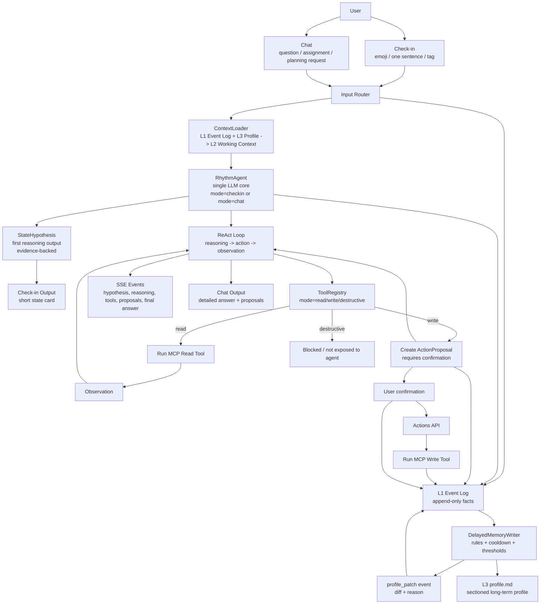
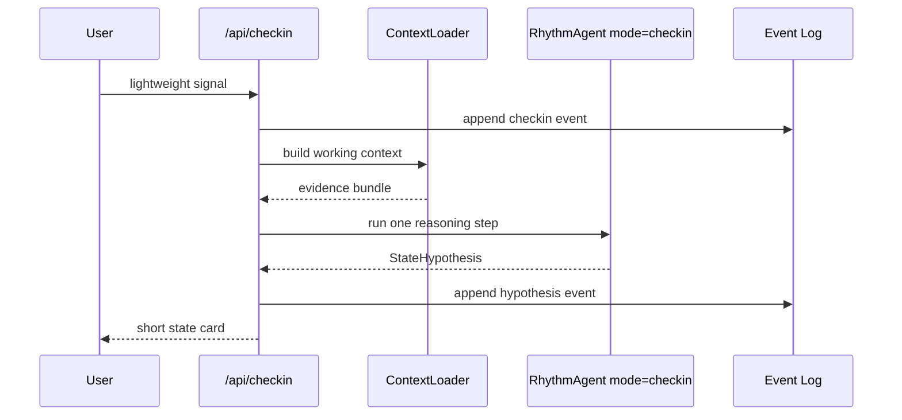
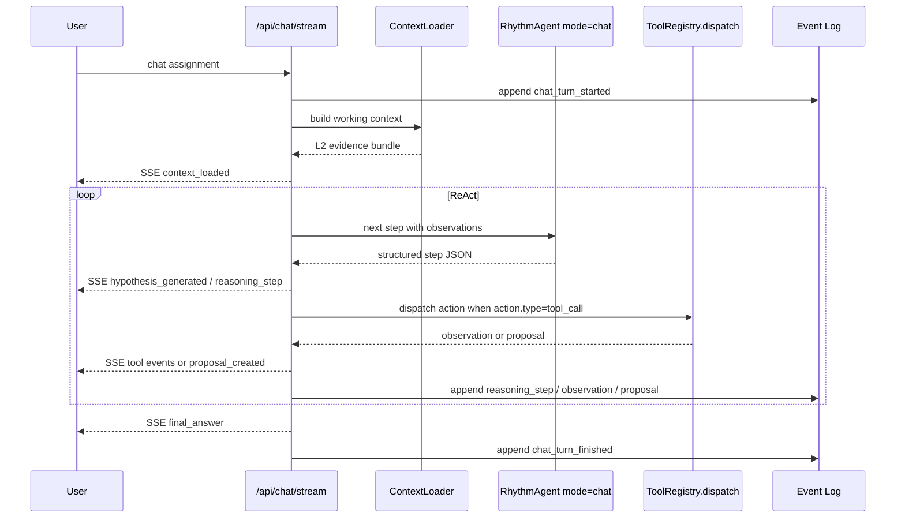

# WeatherFlow v2 ReAct Runtime Implementation Plan

> **For agentic workers:** REQUIRED SUB-SKILL: Use superpowers:subagent-driven-development (recommended) or superpowers:executing-plans to implement this plan task-by-task. Steps use checkbox (`- [ ]`) syntax for tracking.

**Goal:** Redesign WeatherFlow around one shared ReAct agent kernel. Check-in becomes a lightweight hypothesis trigger; chat becomes the full ReAct workspace with SSE-visible reasoning summaries, tool calls, observations, and proposals.

**Architecture:** Runtime components are split only when they need their own prompt or independent eval. v2 has four core components: `ContextLoader`, `RhythmAgent`, `ToolRegistry`, and `MemoryWriter`. `RhythmAgent` is the only LLM reasoning unit. State hypothesis is not a separate pre-step; it is the required structured output of the agent's first reasoning step. Tool read/write/destructive policy lives in the tool registry and dispatcher, not in a separate agent-facing policy layer.

**Tech Stack:** FastAPI, Pydantic, SQLite event log, Markdown `profile.md`, existing MCP client/executor/registry, Server-Sent Events, Next.js/React, TypeScript streaming fetch.

---

## 1. Design Principles

**P1. Runtime components are split by independent prompt/eval needs, not by pipeline step.**

WeatherFlow can have several product intentions, such as hypothesis-first, write-as-proposal, and evidence-grounded output. That does not mean each intention needs its own runtime component. Components are extracted only when they require a separate prompt, separate eval dataset, or materially different failure mode.

**P2. State judgment is the first structured reasoning output, not a separate pre-agent step.**

Check-in and chat use the same `RhythmAgent` kernel. Check-in runs the agent in `mode="checkin"` with strict output constraints. Chat runs the agent in `mode="chat"` with the full ReAct loop. Both modes share the same context assembly, hypothesis contract, SSE protocol, and memory feedback path.

**P3. Tool read/write/destructive mode is a tool registry property.**

The registry knows each tool's mode. The dispatcher executes read tools, converts write tools into proposals, and blocks destructive tools. Write-as-proposal is a small dispatcher rule, not an agent component.

## 2. Core Runtime Components

Only four components exist in v2:

```text
ContextLoader      deterministic data assembly, no LLM
RhythmAgent        only LLM reasoning unit, includes ReAct loop
ToolRegistry       tool table + mode dispatcher
MemoryWriter       delayed, gated long-term memory refresh
```

There is no `HypothesisAgent`, no standalone `ToolPolicy`, no standalone `ProposalBuilder`, and no standalone `ResponseComposer` in v2. Their responsibilities are absorbed into the `RhythmAgent` prompt contract and `ToolRegistry.dispatch()`.

## 3. Complete Information Flow



## 4. Agent Architecture

### 4.1 Check-in Entry

The user sends a lightweight state signal, such as an emoji, a sentence, or a tag. `RhythmAgent` runs with `mode="checkin"`.

Prompt constraints:

- output only `StateHypothesis`;
- do not call tools;
- do not produce proposals;
- do not produce a long `final_answer`;
- use evidence from `ContextLoader`;
- every evidence item must reference an L1 event id or L3 profile section anchor.

Check-in ends after one LLM call. The product displays a compact state card.



Example check-in response:

```json
{
  "state_hypothesis": {
    "label": "Overload",
    "confidence": 0.72,
    "evidence": [
      {
        "source_ref": "event:dev_review:42",
        "summary": "过去 3 天完成了多项 DL 相关任务"
      },
      {
        "source_ref": "event:dev_review:42",
        "summary": "日历中有 4 场 meeting，共约 5.5 小时"
      },
      {
        "source_ref": "event:checkin:118",
        "summary": "最近状态信号提到“有点乱”和“需要收尾”"
      }
    ],
    "counter_evidence": [
      {
        "source_ref": "event:dev_review:42",
        "summary": "GitHub 仍有稳定推进，说明不是完全 Blocked"
      }
    ],
    "missing_evidence": [
      "还缺少你对体感疲劳程度的校准"
    ],
    "calibration_options": ["贴近", "偏 Momentum", "偏 Recovery", "忽略"]
  }
}
```

### 4.2 Chat Entry

The user sends natural language. `RhythmAgent` runs with `mode="chat"`.

Prompt constraints:

- first reasoning step must include `state_hypothesis`;
- after the first step, enter standard ReAct loop;
- each step returns one structured JSON object;
- action may be `tool_call`, `final_answer`, or `stop`;
- read tools are executed by dispatcher;
- write tools are converted into proposals by dispatcher;
- destructive tools are not exposed in the tool schema list.



## 5. RhythmAgent Structured Output Contract

Every reasoning step returns one JSON object:

```json
{
  "state_hypothesis": {
    "label": "Overload",
    "confidence": 0.72,
    "evidence": [
      {
        "source_ref": "event:dev_review:42",
        "summary": "过去 3 天完成了多项 DL 相关任务"
      }
    ],
    "counter_evidence": [],
    "missing_evidence": [],
    "calibration_options": ["贴近", "偏 Momentum", "偏 Recovery", "忽略"]
  },
  "reasoning_summary": "我先检查明天的空档，因为当前状态偏 Overload，适合只安排一个关键块。",
  "action": {
    "type": "tool_call",
    "tool_name": "calendar.find_free_slots",
    "arguments": {
      "duration_minutes": 90
    },
    "content": ""
  }
}
```

Rules:

- `state_hypothesis` is required in the first step for both modes.
- Later steps may omit `state_hypothesis` unless the judgment changes.
- `reasoning_summary` is safe to show to users.
- `reasoning_summary` must not contain private chain-of-thought.
- `action.type="tool_call"` requires `tool_name` and `arguments`.
- `action.type="final_answer"` requires `content`.
- Check-in mode must terminate after the first structured output.

SSE mapping:

```text
state_hypothesis -> hypothesis_generated
reasoning_summary -> reasoning_step
tool_call + mode=read -> tool_call_started -> tool_call_finished -> observation_summary
tool_call + mode=write -> proposal_created
tool_call + mode=destructive -> error
final_answer -> final_answer
```

## 6. ToolRegistry Dispatcher

Tools carry mode as first-class metadata:

```python
class Tool:
    name: str
    mode: Literal["read", "write", "destructive"]
    schema: dict
    run: Callable
```

Dispatcher behavior:

```python
async def dispatch(action, registry, agent_observations):
    tool = registry[action.tool_name]
    if tool.mode == "destructive":
        raise ToolNotAvailable(tool.name)
    if tool.mode == "read":
        obs = await tool.run(**action.arguments)
        agent_observations.append(obs)
        return ("observation", obs)
    if tool.mode == "write":
        proposal = Proposal(
            tool_name=tool.name,
            arguments=action.arguments,
            rationale=action.reasoning_summary,
            requires_confirmation=True,
        )
        agent_observations.append({"proposal_created": proposal.id})
        return ("proposal", proposal)
```

Important invariant:

> Destructive tools are filtered out of the schema list before tools are shown to `RhythmAgent`. The agent should not know they exist.

Initial modes:

```text
read:
  calendar.search_events
  calendar.find_free_slots
  github.get_repo_status
  github.get_recent_commits
  github.list_issues
  github.list_pull_requests

write:
  calendar.create_focus_block
  calendar.create_event
  github.create_issue

destructive:
  calendar.delete_event
  calendar.update_event
  github.update_issue
  github.create_or_update_file
```

## 7. Memory System

### 7.1 Three Layers and One Gate

```text
L1 Event Log         SQLite, append-only, all raw events
L2 Working Context   per-request evidence bundle, temporary, not persisted
L3 Profile           profile.md, long-term, human-readable/editable
        ^
        |
Gate: DelayedMemoryWriter, async + thresholded + explainable
```

### 7.2 L1 Event Log

L1 records facts, not interpretations produced by memory rewriting.

Event types:

```text
checkin
state_snapshot
chat_turn
hypothesis
hypothesis_feedback
proposal
executed_action
dev_review
reflection
reasoning_step
tool_observation
profile_patch
```

All L1 writes are deterministic and do not require an LLM.

### 7.3 L2 Working Context

L2 is built by `ContextLoader` for each request.

Sources:

- recent L1 events;
- selected L3 profile sections;
- available tool schemas excluding destructive tools.

Invariants:

- L2 does not persist;
- ordinary chat text does not become profile memory;
- if caching is added later, cache only a hash or short-lived compiled form, not durable memory.

### 7.4 L3 Profile

`profile.md` is sectioned and patchable:

```markdown
# Identity
独立开发者,聚焦 LLM/Agent/RAG,偏好 <=5k LOC 的小项目

# Rhythm Patterns
- Overload 信号:会议 >=4 + DL 任务并行 + 主观"乱"
- Recovery 模式:单一 deep work block > 多任务清单

# Preferences
- 工具:Cursor, Claude Code
- 时间:上午是 deep work,下午容易碎片化

# Anti-patterns
- 同时启动多个新方向 -> 历史上 3 次失败

# Recent Themes
(rolling window, DelayedMemoryWriter 维护)
```

`ContextLoader` reads sections selectively:

- check-in uses `Rhythm Patterns` and `Recent Themes`;
- chat may also include `Preferences` and `Anti-patterns` depending on user message.

### 7.5 DelayedMemoryWriter Gate

L1 events can update L3 only when all relevant gates pass:

1. signal type is whitelisted:
   - `confirmed_hypothesis`
   - `corrected_hypothesis`
   - `executed_action`
   - `explicit_preference`
   - `repeated_pattern`
2. cooldown passes:
   - same signal class refreshes at most once every configured N hours;
3. repeated-pattern threshold passes:
   - same pattern appears at least K times in M days;
4. profile write is a patch:
   - every L3 write also appends a `profile_patch` event to L1 with diff and trigger reason.

The LLM may draft patch text, but it must not decide whether memory should be updated. That decision is rule/config driven.

### 7.6 Evidence Traceability Rule

When `RhythmAgent` outputs `state_hypothesis`, at least one evidence item must trace to:

- an L1 event id, such as `event:dev_review:42`; or
- an L3 section anchor, such as `profile:Rhythm Patterns`.

This prevents ungrounded hypotheses and lets hypothesis feedback mark which evidence was wrong, weak, or useful.

## 8. Subagent Policy

v2 does not introduce subagents.

Future split points are explicit:

**A. `StateAnalyst` subagent**

Extract only when:

- evidence sources exceed six materially different classes; and
- hypothesis quality drops on evals.

Contract:

```text
evidence_bundle -> state_hypothesis
```

Eval dataset:

```text
historical evidence + user later calibration
```

**B. `ScheduleArchitect` subagent**

Extract only when proposals evolve from single-step actions to multi-step calendar restructuring:

```text
goal + hard constraints -> proposal sequence
```

Examples:

- reorder several meetings;
- create multiple focus blocks;
- coordinate constraints with external participants.

Do not split these early. Subagents add prompt maintenance, context passing, evaluation burden, and debugging complexity.

## 9. Overall Chat Request Flow

```text
1. POST /api/chat/stream
2. ContextLoader builds L2 from L1 + selected L3 sections + tool schemas
3. SSE: context_loaded
4. RhythmAgent.run(mode="chat", evidence=bundle, message=...)
   loop:
     a. LLM returns structured JSON
     b. state_hypothesis in first step -> SSE: hypothesis_generated
     c. reasoning_summary -> SSE: reasoning_step
     d. action:
        - tool_call + read        -> dispatch executes -> SSE tool_call_* + observation_summary
        - tool_call + write       -> dispatch creates proposal -> SSE proposal_created
        - tool_call + destructive -> error, because destructive schema should not be exposed
        - final_answer            -> SSE final_answer, break
5. L1 append events throughout:
   chat_turn, hypothesis, reasoning_step, tool_observation, proposal
6. User confirms proposal:
   POST /api/actions/{id}/execute
7. Actions API calls MCP write tool
8. L1 append executed_action
9. DelayedMemoryWriter checks gates
10. If gates pass, patch profile.md and append profile_patch
```

## 10. Differences from Previous Plan

| Dimension | Previous Plan | v2 |
| --- | --- | --- |
| LLM reasoning components | HypothesisAgent + ReActPlanner + ResponseComposer | RhythmAgent only |
| Tool governance | ToolPolicy + ProposalBuilder | ToolRegistry mode + dispatcher |
| Hypothesis generation | separate pre-step | first structured field of RhythmAgent reasoning |
| Check-in / Chat | related but separate paths | same agent kernel, different mode and max_steps |
| Memory | delayed writer | delayed writer + explicit gates + profile_patch audit |
| Profile usage | broad profile excerpt | sectioned profile, selected by ContextLoader |
| Evidence grounding | product rule | hard source_ref / profile anchor invariant |
| Subagents | none | none, with explicit future split criteria |

## 11. Implementation Order

### Task 1: Add Tool Modes and Dispatcher

**Files:**
- Modify: `backend/app/mcp_client/tool_registry.py`
- Modify: `backend/app/memory/schemas.py`
- Test: `backend/tests/test_tool_registry.py`

- [ ] Add `mode: Literal["read", "write", "destructive"]` to tool metadata.
- [ ] Register known Calendar/GitHub tools with mode.
- [ ] Add dispatcher that executes read tools, creates proposals for write tools, and blocks destructive tools.
- [ ] Filter destructive tools out of schemas passed to `RhythmAgent`.

### Task 2: Introduce L1/L2/L3 Memory Semantics

**Files:**
- Modify: `backend/app/memory/store.py`
- Create: `backend/app/memory/event_log.py`
- Modify: `backend/app/memory/profile_md.py`
- Test: `backend/tests/test_event_log.py`
- Test: `backend/tests/test_profile_sections.py`

- [ ] Add append-only event log helpers.
- [ ] Add event types for chat, hypothesis, proposal, executed action, reasoning step, tool observation, and profile patch.
- [ ] Add sectioned profile read helpers.
- [ ] Ensure L2 working context is never persisted as a blob.

### Task 3: Build ContextLoader

**Files:**
- Create: `backend/app/core/context_loader.py`
- Test: `backend/tests/test_context_loader.py`

- [ ] Load recent L1 events.
- [ ] Load selected L3 profile sections.
- [ ] Load latest state and latest Dev Review.
- [ ] Load available tool schemas excluding destructive tools.
- [ ] Add source refs to every evidence item.

### Task 4: Implement RhythmAgent

**Files:**
- Create: `backend/app/agents/rhythm_agent.py`
- Modify: `backend/app/core/prompts.py`
- Modify: `backend/app/agents/__init__.py`
- Test: `backend/tests/test_rhythm_agent.py`

- [ ] Implement `run(mode="checkin")` as one structured LLM call.
- [ ] Implement `run(mode="chat")` as ReAct loop.
- [ ] Enforce first-step `state_hypothesis`.
- [ ] Validate evidence source refs.
- [ ] Emit structured step objects ready for SSE mapping.

### Task 5: Check-in Fast Path

**Files:**
- Modify: `backend/app/routers/checkin.py`
- Test: `backend/tests/test_checkin_flow.py`

- [ ] Save lightweight check-in signal to L1.
- [ ] Build context through `ContextLoader`.
- [ ] Run `RhythmAgent(mode="checkin")`.
- [ ] Return concise state hypothesis only.
- [ ] Remove user-visible long reflection/planning payload from check-in response.

### Task 6: Chat SSE Path

**Files:**
- Create: `backend/app/routers/chat.py`
- Modify: `backend/app/main.py`
- Test: `backend/tests/test_chat_api.py`

- [ ] Implement `POST /api/chat/stream`.
- [ ] Map structured agent JSON to SSE events.
- [ ] Dispatch tool actions through `ToolRegistry`.
- [ ] Append chat, reasoning, observation, proposal events to L1.
- [ ] End stream on `final_answer`.

### Task 7: Proposal Confirmation and Write Execution

**Files:**
- Modify: `backend/app/routers/actions.py`
- Test: `backend/tests/test_actions_api.py`

- [ ] Keep proposals confirmation-gated.
- [ ] Execute write tools only after explicit confirmation.
- [ ] Append `executed_action` to L1.
- [ ] Keep destructive tools blocked.

### Task 8: DelayedMemoryWriter

**Files:**
- Create: `backend/app/core/memory_writer.py`
- Modify: `backend/app/agents/memory_agent.py`
- Test: `backend/tests/test_memory_writer.py`

- [ ] Implement whitelist gates.
- [ ] Implement cooldown gates.
- [ ] Implement repeated-pattern threshold.
- [ ] Patch profile sections instead of rewriting the whole profile.
- [ ] Append `profile_patch` event with diff and trigger reason.

### Task 9: Frontend Runtime UI

**Files:**
- Create: `frontend/components/RhythmChat.tsx`
- Create: `frontend/components/StateHypothesisCard.tsx`
- Modify: `frontend/app/page.tsx`
- Modify: `frontend/lib/api.ts`

- [ ] Render check-in as lightweight signal capture.
- [ ] Render state hypothesis card with evidence, counter-evidence, missing evidence, and calibration options.
- [ ] Stream chat SSE events.
- [ ] Show reasoning summaries, tool calls, observation summaries, proposals, and final answer.
- [ ] Confirm proposals through actions API.

### Task 10: Verification

- [ ] Run `make backend-lint backend-test`.
- [ ] Run `cd frontend && npm run lint && npm run build`.
- [ ] Smoke test:
  - check-in returns a short hypothesis card;
  - chat emits `context_loaded`;
  - first chat reasoning step emits `hypothesis_generated`;
  - read tools execute and stream observations;
  - write tools create proposals;
  - confirmed proposal executes;
  - profile updates only through gated memory writer.

## 12. Scope Decisions

Included in v2:

- one shared `RhythmAgent`;
- check-in as lightweight hypothesis trigger;
- chat as mandatory ReAct runtime;
- tool mode dispatcher;
- proposal-only write actions;
- sectioned profile;
- append-only event log;
- delayed memory writer with gates;
- evidence traceability.

Excluded from v2:

- subagents;
- direct write execution from chat;
- destructive tool exposure;
- autonomous background execution;
- multi-user auth;
- model fine-tuning.

## 13. Self-Review

- Spec coverage: This plan implements the requested v2 architecture: four runtime components, shared agent kernel, first-step state hypothesis, registry-level tool modes, and gated memory.
- Placeholder scan: No unresolved implementation placeholders remain.
- Type consistency: Runtime names are stable: `ContextLoader`, `RhythmAgent`, `ToolRegistry`, and `MemoryWriter`.
- Scope check: The plan is large but sequential. Implementation order starts with low-risk tool registry changes, then context/memory, then agent/runtime, then UI.

